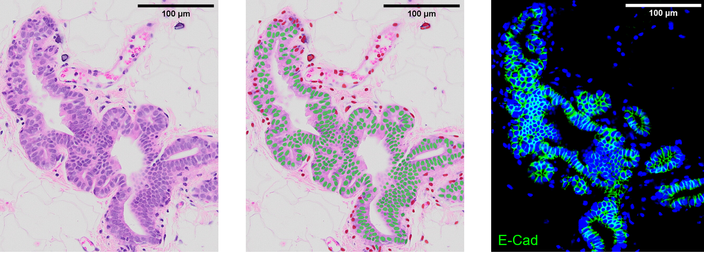

# Single Cell Classifier

Single Cell Classifier (SCC) is an ImageJ/Fiji plugin that aims to classify cells based on features related to their nuclei and their neighbors.
The detection is done with the [StarDist plugin](https://github.com/mpicbg-csbd/stardist).

This example show the classification (middle) of an H&E image (left) and the fluorescence control image (right).

## Release

The release jar file can be found [here](/release).

## Documentation and examples

The plugin documentation is available [here](/documentation/plugin_documentation.pdf).

You can find Python scripts to train your own models our analyze your measurements [here](/Python%20script).
You can find the data used in these scripts [here](/data).

## Existing models

The following models are included in the plugin:

### Segmentation

- *Nuclei Breast 20X H&E PDX*: Nuclei segmentation for Breast 20X H&E PDX models.

**Models from StarDist**

- *Versatile (fluorescent nuclei)*: Nuclei segmentation for fluorescence images.
- *Versatile (H&E nuclei)*: Nuclei segmentation for H&E images.
- *DSB 2018 (from StarDist 2D paper)*: Nuclei segmentation for fluorescence images trained from the 2018 Data Science Bowl dataset.

### Classification

- *Human/Mouse Breast 20X H&E PDX*: Human/Mouse classification for Breast 20X H&E PDX models.
